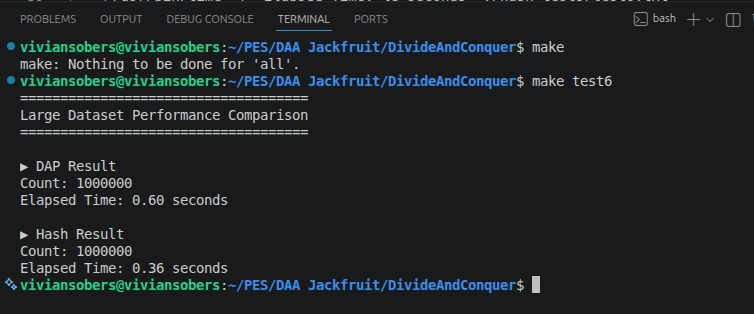
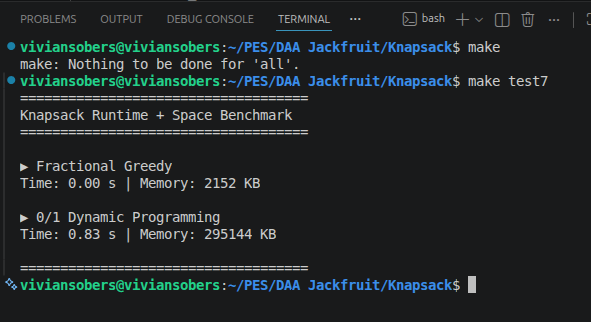

# Algorithmic Problem Solving — DAA Jackfruit Project

Implementation and experimental analysis of three algorithm design paradigms: **Divide and Conquer**, **Greedy**, and **Dynamic Programming**, built in C.

---
##  Team Information

| Name | SRN |
|------|-----|
| D Harikrishnan | PES1UG24CS136|
| Dhawal Pathak | PES1UG24CS151 |
| Vivian Sobers E | PES1UG24CS901 |
| Aryan Upadhyay | PES1UG25CS806|


---
## Repository Structure

```
Algorithmic-Problem-Solving/
│
├── DivideAndConquer/
│   ├── dap.c
│   ├── hash.c
│   ├── Makefile
│   └── tests/
│
├── Greedy/
│   ├── efs.c
│   ├── Makefile
│   └── tests/
│
├── Knapsack/
│   ├── frac_greedy.c
│   ├── dp01.c
│   ├── knapsack.h
│   ├── Makefile
│   └── tests/
│
├── screenshots/
└── README.md
```

---

## Problem 1 — Greedy
### Early Finish Scheduling (EFS)

**Problem:** Given `n` events, each with a start time `sᵢ` and end time `eᵢ`, select the maximum number of non-overlapping events schedulable in a single room. Two events overlap if one starts before the other ends.

---

### Approach

Always select the event that finishes earliest among all remaining compatible events. This greedy choice is provably optimal: the earliest-finishing event leaves the maximum time window available for subsequent selections. Any other choice either reduces or ties the remaining capacity — it cannot improve it.

**Exchange argument:** Suppose an optimal solution `OPT` does not include the earliest-finishing event `e*`. Replace the first event in `OPT` with `e*`. Since `e*` finishes no later, no subsequent event that was compatible with the replaced event becomes incompatible. The count does not decrease, so the exchange is valid. By induction, a solution containing `e*` is always at least as good.

---

### Example

```
Events: A(1,3)  B(2,5)  C(4,6)  D(6,8)

Sort by end time → A(3), B(5), C(6), D(8)

Select A (ends at 3)
  B: start 2 < 3 → skip
  C: start 4 ≥ 3 → select (ends at 6)
  D: start 6 ≥ 6 → select (ends at 8)

Selected: A → C → D   (3 events)
```

---

### Algorithm Steps

1. Sort all events by finish time in ascending order — heap sort
2. Select the first event; record its end time as `last_end`
3. For each subsequent event: if `start ≥ last_end`, select it and update `last_end`
4. Return count of selected events

```
EFS(events, n):
    heap_sort(events by end time)
    count = 1
    last_end = events[0].end
    for i = 1 to n-1:
        if events[i].start >= last_end:
            count++
            last_end = events[i].end
    return count
```

---

### Complexity

| | EFS |
|---|---|
| Sorting | O(n log n) |
| Selection pass | O(n) |
| Time | O(n log n) |
| Space | O(1) excluding input |

---

### Data Structures

- Struct array: each event holds `start`, `end`, `name`
- In-place heap sort — no auxiliary array needed
- Iterative heapify to avoid recursion overhead

---

### Implementation Details

- `efs.c` implements both sorting and selection in a single module
- Events are read from file and stored in a struct array
- Test cases: all overlapping, no overlapping, single event, ties on end time, large random datasets

---

## Problem 2 — Divide and Conquer
### Dual Array Partitioning (DAP)

**Problem:** Given a sorted array `A[0..n-1]` of `n` distinct integers and an unsorted array `B[0..m-1]` of `m` distinct integers, count how many elements of `B` appear in `A`.

---

### Approach

The algorithm exploits the sorted structure of `A` by selecting its median as a pivot. `B` is split into three partitions — elements less than, equal to, and greater than the pivot. Recursion then proceeds independently on each relevant half of `A` with the corresponding partition of `B`. This avoids scanning the entire `A` for every element of `B` and prunes unnecessary comparisons at each level.

---

### Example

```
A = [2, 4, 6, 8, 10, 12]
B = [12, 10, 8, 6, 4, 2]

Step 1: pivot = A[6/2] = A[3] = 8
  less    → [6, 4, 2]   recurse on A_left  = [2, 4, 6]
  equal   → [8]         count += 1
  greater → [12, 10]    recurse on A_right = [10, 12]

Step 2: A_left = [2,4,6], B_left = [6,4,2]
  pivot = A[1] = 4
  less    → [2]     recurse on [2]       → pivot = 2, equal → count += 1
  equal   → [4]     count += 1
  greater → [6]     recurse on [6]       → pivot = 6, equal → count += 1

Step 3: A_right = [10,12], B_right = [12,10]
  pivot = A[1] = 12
  less    → [10]    recurse on [10]      → pivot = 10, equal → count += 1
  equal   → [12]    count += 1

Final count = 6
```

---

### Algorithm Steps

1. If either array is empty, return `0`
2. Select the middle element of `A` as pivot
3. Partition `B` into `less`, `equal`, `greater`
4. Recurse: `DAP(A_left, less)` and `DAP(A_right, greater)`
5. Return `left_count + |equal| + right_count`

```
DAP(A, n, B, m):
    if n == 0 or m == 0: return 0
    pivot = A[n/2]
    partition B → less, equal, greater
    left  = DAP(A[0..n/2-1], less)
    right = DAP(A[n/2+1..n-1], greater)
    return left + |equal| + right
```

---

### Recurrence Relation

At each recursive call, `A` is halved and `B` is partitioned:

```
T(n, m) = T(n/2, m₁) + T(n/2, m₂) + O(m)
```

Since `m₁ + m₂ ≤ m`, the work at each level across all nodes sums to `O(m)`. The recursion depth on `A` is `log n`, giving:

```
T(n, m) = O(m log n)
```

---

### Complexity

| | DAP |
|---|---|
| Time (all cases) | O(m log n) |
| Space | O(m) |

Space is consumed by the `less`, `equal`, `greater` partitions allocated at each level. Maximum live allocation at any point is `O(m)`.

---

### Data Structures

- Dynamic arrays allocated with `calloc` for the three partitions
- Recursive divide-and-conquer call tree implicit in the call stack

---

## Comparison Algorithm — Hash-Based Approach
## Transform and Conquer

### Approach

All elements of `A` are inserted into a hash table of size `HASH_SIZE = 2000003`. Each slot stores a `data` field and a `flag` field: `flag = -1` means empty, `flag = 1` means occupied. Collision resolution uses linear probing — on collision, the index advances by 1 modulo `HASH_SIZE` until an empty slot is found. During search, probing continues past occupied slots until an empty slot (`flag == -1`) is encountered or the table wraps around.

```
Hash(A, n, B, m):
    initialize ht[HASH_SIZE] with flag = -1 for all slots
    for i = 0 to n-1:
        index = abs(A[i]) % HASH_SIZE
        probe until flag != 1, insert A[i] with flag = 1
    count = 0
    for i = 0 to m-1:
        index = abs(B[i]) % HASH_SIZE
        probe while flag != -1:
            if flag == 1 and data == B[i]: count++; break
            index = (index + 1) % HASH_SIZE
    return count
```

**Example — searching for key `8` with `HASH_SIZE = 11`:**

```
hash_func(8) = 8 % 11 = 8

Slot 8: flag = 1, data = 8  → match found, return 1
```

**Collision example — inserting keys 8 and 19:**

```
hash_func(8)  = 8 % 11 = 8  → slot 8 empty, insert here
hash_func(19) = 19 % 11 = 8 → slot 8 occupied, probe slot 9 → empty, insert here
```

---

### Complexity

| | Hash |
|---|---|
| Time (average) | O(n + m) |
| Time (worst) | O(nm) |
| Space | O(n) |

---

### DAP vs Hash — Comparison

| Aspect | DAP | Hash |
|---|---|---|
| Paradigm | Divide and Conquer | Transform and Conquer |
| Average time | O(m log n) | O(n + m) |
| Worst-case time | O(m log n) | O(nm) |
| Space | O(m) | O(n) |
| Uses recursion | Yes | No |
| Requires sorted A | Yes | No |
| Collision handling | N/A | Linear probing |
| Predictability | Consistent | Load-factor dependent |

Hash has better average-case complexity. DAP is more predictable — its worst case matches its average case, while hash degrades to `O(nm)` under heavy collisions.

---

### Benchmark — n = 1,000,000 / m = 2,000,000



Hash ran approximately **40% faster** at this scale, consistent with its `O(n+m)` average-case advantage. Results validate theoretical analysis.

---

### Implementation Details

- Separate `dap.c` and `hash.c` with independent build targets
- Hash table size `HASH_SIZE = 2000003` (prime) to reduce clustering
- Slots initialised with `flag = -1`; insertion sets `flag = 1`
- Memory managed with `calloc` / `free` throughout
- Benchmarked using `/usr/bin/time` on identical randomly generated datasets
- Test suite covers: normal input, empty arrays, all matches, no matches, duplicates, large-scale benchmark

---

## Problem 3 — Knapsack
## Fractional Knapsack (Greedy) vs 0/1 Knapsack (Dynamic Programming)

**Problem:** Given `n` items each with weight `wᵢ` and profit `pᵢ`, and a knapsack of capacity `W`, maximise total profit.


### Fractional Knapsack — Greedy Approach

Items may be taken in fractional quantities.

**Approach:** Rank items by profit-to-weight ratio `pᵢ/wᵢ` in descending order. Take items greedily from the top. If the next item exceeds remaining capacity, take the fraction that exactly fills it.

**Why this is optimal:** An exchange argument applies. Consider any unit of capacity filled with item `x` of ratio `rₓ`. If there exists item `y` with `r_y > rₓ`, replacing that unit of `x` with `y` strictly increases profit. Since fractional quantities are allowed, such a replacement is always feasible. Therefore, filling capacity in strict ratio-descending order produces the globally optimal solution.


### Example — Capacity = 60

```
Item   Weight   Profit   Ratio
A      20       100      5.00
B      30       120      4.00
C      40       160      4.00

Take all of A  (20 kg) → remaining = 40
Take all of B  (30 kg) → remaining = 10
Take 25% of C  (10 kg) → remaining = 0

Profit = 100 + 120 + (10/40 × 160) = 100 + 120 + 40 = 260
```

---

### Algorithm Steps

1. Compute `ratio = profit / weight` for each item
2. Sort items by ratio in descending order
3. Iterate: if item fits fully, take it; else take the fraction `remaining_capacity / weight`
4. Stop when capacity is exhausted

```
FracKnapsack(items, n, W):
    compute ratio for each item
    sort items by ratio descending
    profit = 0, remaining = W
    for each item:
        if item.weight <= remaining:
            profit += item.profit
            remaining -= item.weight
        else:
            profit += (remaining / item.weight) * item.profit
            break
    return profit
```

---

### Complexity — Fractional Greedy

| | Fractional Greedy |
|---|---|
| Sorting | O(n log n) |
| Selection | O(n) |
| Total | O(n log n) |
| Space | O(n) |

---

## 0/1 Knapsack — Dynamic Programming Approach

Items are indivisible — each item is either taken in full or not at all. Greedy fails here because taking the highest-ratio item may block a better combination of remaining items.

**Approach:** Build a 2D table `dp[i][w]` representing the maximum profit achievable using the first `i` items with capacity `w`, filled bottom-up.

### Example — Capacity = 60 (0/1 Dynamic Programming)

Items considered:

| Item | Weight | Profit |
|------|-------:|-------:|
| A | 20 | 100 |
| B | 30 | 120 |
| C | 40 | 160 |

Dynamic Programming table:

| Item \\ Capacity | 0 | 10 | 20 | 30 | 40 | 50 | 60 |
|------------------|---:|---:|---:|---:|---:|---:|---:|
| 0 Items          | 0 | 0 | 0 | 0 | 0 | 0 | 0 |
| A (20,100)       | 0 | 0 | 100 | 100 | 100 | 100 | 100 |
| B (30,120)       | 0 | 0 | 100 | 120 | 120 | 220 | 220 |
| C (40,160)       | 0 | 0 | 100 | 120 | 160 | 220 | 260 |

The final answer is obtained from the last cell:

`dp[3][60] = 260`

Backtracking from the table gives:

- **A → 20 kg, 100 profit**
- **C → 40 kg, 160 profit**

**Total Weight = 60**  
**Maximum Profit = 260**

---
### Recurrence Relation

For each item `i` with weight `wᵢ` and profit `pᵢ`:

```
dp[i][w] = max( dp[i-1][w],  dp[i-1][w - wᵢ] + pᵢ )   if wᵢ ≤ w
         = dp[i-1][w]                                    otherwise
```

Base case: `dp[0][w] = 0` for all `w`. The answer is `dp[n][W]`.

The first branch skips item `i`; the second includes it, reducing the remaining capacity by `wᵢ` and adding `pᵢ`. Since each subproblem `dp[i-1][...]` is computed before `dp[i][...]`, the table is filled row by row, left to right.

---

### Algorithm Steps

```
DP01(items, n, W):
    dp[0..n][0..W] = 0
    for i = 1 to n:
        for w = 1 to W:
            if items[i].weight <= w:
                dp[i][w] = max(dp[i-1][w], dp[i-1][w - items[i].weight] + items[i].profit)
            else:
                dp[i][w] = dp[i-1][w]
    return dp[n][W]
```

---

### Complexity — 0/1 DP

| | 0/1 DP |
|---|---|
| Time | O(nW) |
| Space | O(nW) |

`O(nW)` is pseudo-polynomial — it depends on the numeric value of `W`, not its bit-length. For large `W` this becomes the dominant cost.

---

### Data Structures

**Fractional Greedy:** Item struct array, sorted in-place with heap sort.

**0/1 DP:** Heap-allocated 2D table of size `(n+1) × (W+1)`, item struct array. The table is the primary memory cost.

---

### Fractional Greedy vs 0/1 DP — Comparison

| Aspect | Fractional Greedy | 0/1 DP |
|---|---|---|
| Paradigm | Greedy | Dynamic Programming |
| Fractions allowed | Yes | No |
| Optimal | Yes | Yes |
| Time complexity | O(n log n) | O(nW) |
| Space complexity | O(n) | O(nW) |
| Handles indivisible items | No | Yes |
| Scales with W | Unaffected | Degrades |
| Memory at n=5000, W=15000 | ~2 MB | ~295 MB |

The greedy approach cannot solve the 0/1 variant correctly — a counterexample exists whenever the highest-ratio item blocks a higher-profit combination. DP is necessary when items are indivisible. The cost is significant: both time and memory scale with `W`, making DP impractical for very large capacities.

---

### Experimental Results — n = 5,000 / W = 15,000

| Algorithm | Time | Memory |
|---|---|---|
| Fractional Greedy | 0.00 s | 2,152 KB |
| 0/1 DP | 0.83 s | 295,144 KB |

DP consumed **137× more memory** and was measurably slower due to the `O(nW)` table construction. Results are consistent with theoretical predictions.

### Benchmark — n = 5,000 / W = 15,000



---

### Implementation Details

- `frac_greedy.c` and `dp01.c` share `knapsack.h` for the item struct definition
- DP table allocated with `calloc` and freed after use
- Both implementations tested against identical item sets for result verification
- Test cases: exact capacity fit, single item, all items identical weight, W = 0, large benchmark

---

## Building and Running

Each module has its own `Makefile`. From within any subdirectory:

```bash
make            # build
make test6      # large benchmark — DivideAndConquer
make test7      # large benchmark — Knapsack
```
